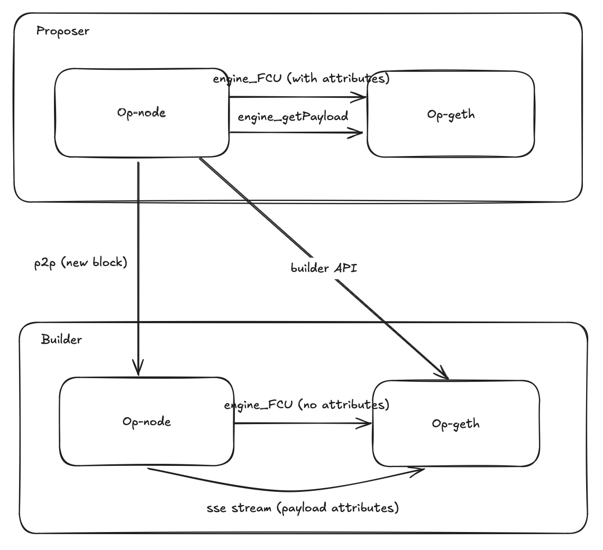

# Builder API
<!-- START doctoc generated TOC please keep comment here to allow auto update -->
<!-- DON'T EDIT THIS SECTION, INSTEAD RE-RUN doctoc TO UPDATE -->
**Table of Contents**

- [Overview](#overview)
- [Op-node <> Op-geth](#op-node--op-geth)
  - [Requesting a Block](#requesting-a-block)
  - [Block Building](#block-building)
- [Op-node <> Op-node](#op-node--op-node)
  - [Requesting a Block](#requesting-a-block-1)
  - [Block Building](#block-building-1)
- [Op-geth <> Op-geth](#op-geth--op-geth)
  - [Requesting a Block](#requesting-a-block-2)
  - [Block Building](#block-building-2)
- [Authentication](#authentication)
  - [Builder Authentication](#builder-authentication)
  - [Proposer Authentication](#proposer-authentication)
- [Builder Configuration](#builder-configuration)
- [Mempool Forwarding](#mempool-forwarding)

<!-- END doctoc generated TOC please keep comment here to allow auto update -->

## Overview

The following provides several options of the Builder API within the Optimism stack. It provides the advantages and disadvantages of the different Sequencer Builder interactions.

## Op-node <> Op-geth

### Requesting a Block

In this approach the op-node on the proposer side requests the block from the block builder's execution engine. A block is requested from both the proposer's local execution engine and the block builder in parallel.

The proposer validates the blocks and can fall back to its local block if the block builder block is invalid.

### Block Building
 
The block payload attributes is required to build a block on top of the latest head. In this approach the builder runs a synced op-node that provides a payload attributes event stream for op-geth to subscribe to.

While the op-node can provide the payload attributes via the fork choice update, this method would propagate the builder block via p2p.

**Advantages:**
* Better latency as the proposer queries the builder payload directly from the builder's op-geth

**Disadvantages:**
* Modifications to both op-node and op-geth to support this method. On the proposer side, this requires modifications to the op-node to make the builder API request. The the builder side, modifications to op-geth and op-node are needed to stream the payload attributes and handle the builder API request.

## Op-node <> Op-node

### Requesting a Block

In this approach the op-node on the proposer side requests the block from op-node on the builder. Similar to the previous approach, there will be a failsafe mechanism of requesting both the local and builder block. 

However the builder's op-node will return the payload to the proposer by requesting the block from its execution engine via the `engine_getPayload` method.

### Block Building

In this approach, block building is triggered by enabling block payload attributes in the `engine_forkchoiceUpdated` call. Payload attributes are populated in this call when sequencer mode is enabled on the builder's op-node. Additional config will be needed in op-node to prevent the builder block to be propagated via p2p.

**Advantages:**
* No modifications to op-geth and minimal changes to op-node

**Disadvantages:**
* There will still be modifications needed for op-geth for any custom block building logic
* Latency concerns as the block will be going through an additional hop through the builder's op-node

## Op-geth <> Op-geth

### Requesting a Block

In this approach the op-geth on the proposer side requests the block from the op-geth on the builder side. The proposer op-geth will compare this block with its locally built block and return the best payload to op-node on the `engine_getPayload` call.

### Block Building

Block building is triggered similarly as the previous approach, using the `engine_forkchoiceUpdated` call. The builder op-geth can disable the `engine_getPayload` call to prevent the builder block from being propagated via p2p.

**Advantages:**
* No modifications to op-node and any custom block building logic can be added alongside the builder API changes
* Better latency as the execution engines are communicating directly with each other

**Disadvantages:**
* Weaker liveness guarantees as the proposer can not fallback to its local block if the builder block fails op-node block validation

## Authentication

### Builder Authentication

A builder is defined as the tuple (`builderAddress`, `builderUrl`) managed by the proposer. The block payload returned by the builder must be signed for the proposer to verify the signature and ensure the block is from its managed list of builders.

### Proposer Authentication

The proposer must sign the request to get the block payload from the builder. The builder must verify the proposer's signature before releasing the payload to prevent transcation leakage. This key will need to be tracked by the builder but will eventually live on the
L1 [`SystemConfig`](https://github.com/ethereum-optimism/specs/blob/main/specs/protocol/system_config.md)
where the condig can be queried from a rpc.

## Builder Configuration

A builder is defined as the tuple (`builderPubkey`, `builderUrl`). The Sequencer is responsible for managing this
tuple, but it will eventually live on the
L1 [`SystemConfig`](https://github.com/ethereum-optimism/specs/blob/main/specs/protocol/system_config.md)
where changes are emitted as an event. ***Builder's have no restriction or policies enforced on them at this time.***

## Mempool Forwarding

Transactions going through the Sequencer's RPC gateway can be multiplexed to the builder via `eth_sendRawTransaction` ensuring that user transactions are included in the builder block.
